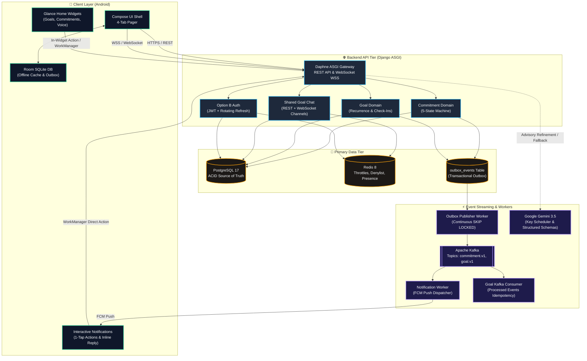
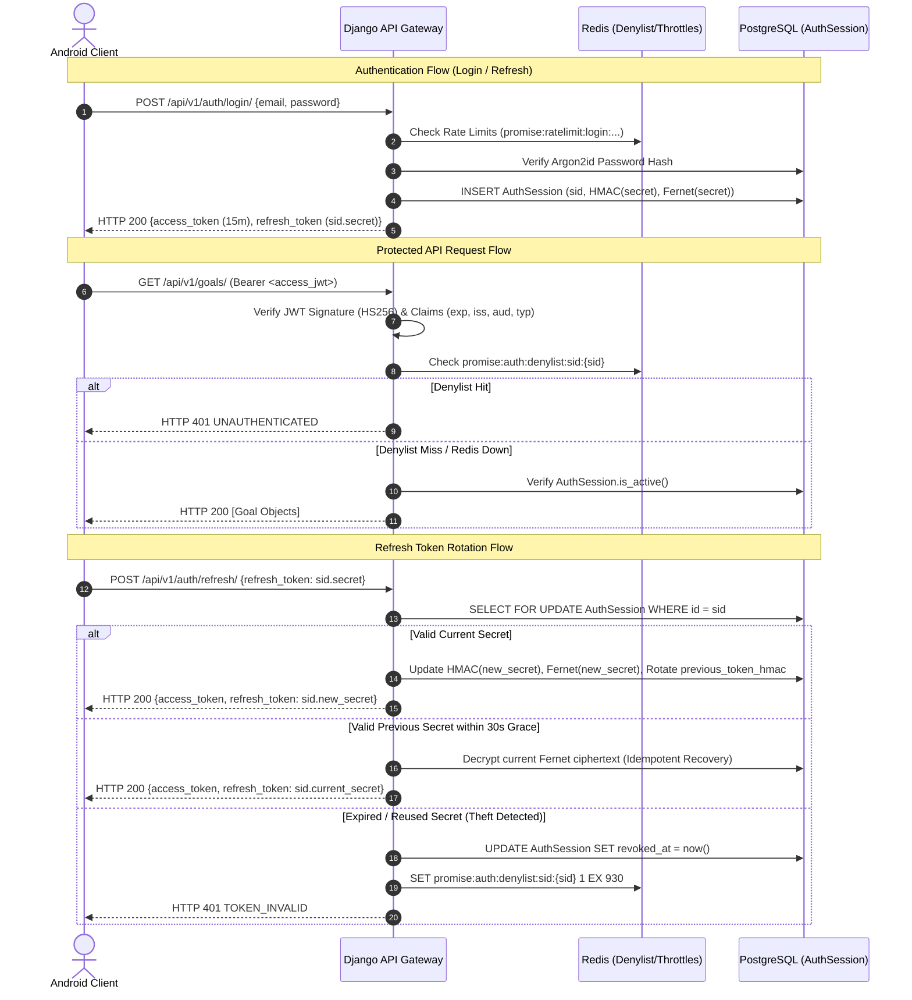
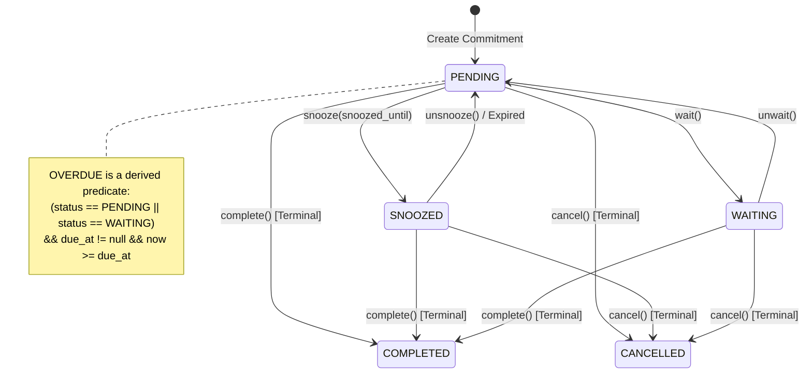
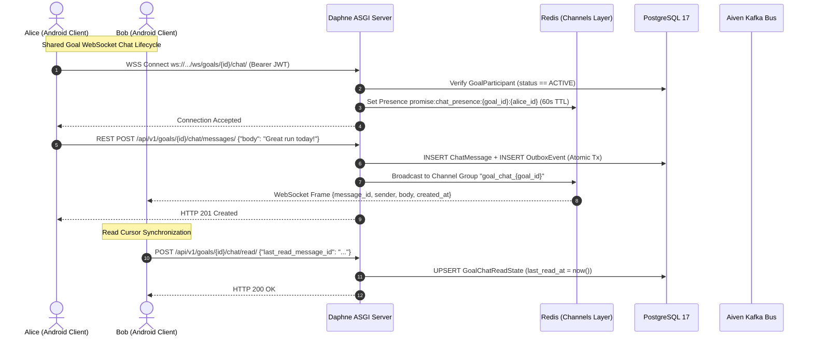
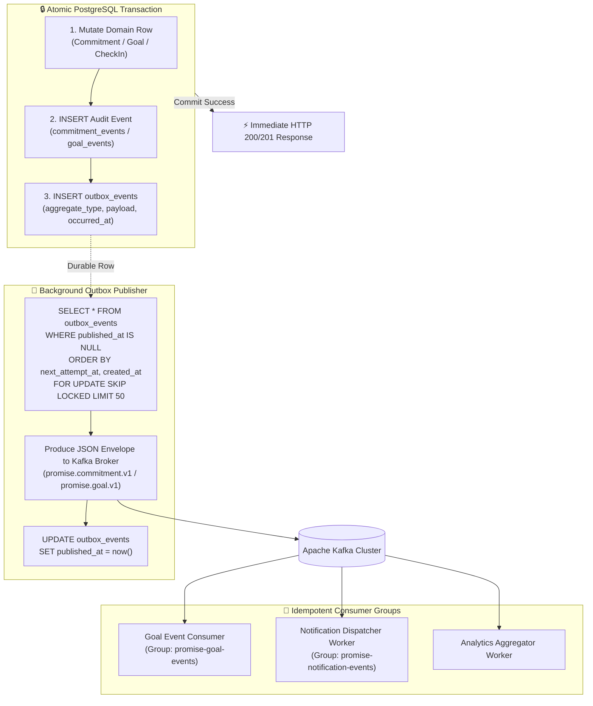
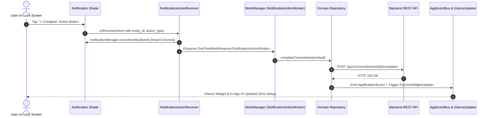

# Promise — Master System Documentation & Knowledge Vault

> **Promise** is a calm, personal commitment tracking, daily habit accountability, and shared achievement platform integrating **Google Gemini AI** and interactive **Android Glance home screen widgets**.
> 
> *“A quiet desk: paper, ink, and one restrained accent. Remember what you promised others. Remember what you promised yourself.”*

---

## 🗺️ Obsidian Navigation Hub & Graph Index



### Table of Contents
1. [[#1. Product Philosophy, Vision & Core Domain Boundaries]]
2. [[#2. System Architecture, Topology & Technical Invariants]]
3. [[#3. Authentication, Cryptography & Session Management]]
4. [[#4. Core Domain I — Finite Commitments & State Machine]]
5. [[#5. Core Domain II — Goals, Recurrence, Check-Ins & Shared Goal Chat]]
6. [[#6. Transactional Outbox Pattern & Apache Kafka Event Backbone]]
7. [[#7. Redis Product Layer — Throttling, Caching & Ephemeral Coordination]]
8. [[#8. Push Notifications, FCM Dispatcher & Action Execution Engine]]
9. [[#9. AI Cognitive Subsystem — Google Gemini Engine & Voice Capture]]
10. [[#10. Product Analytics & Privacy-Preserving Telemetry]]
11. [[#11. Android Architecture, Design Tokens, Glance Widgets & Wallpaper Engine]]
12. [[#12. Development Lifecycle & Multi-Phase Roadmap History]]
13. [[#13. Infrastructure, Production Deployment & DevOps Runbook]]
14. [[#14. Build Progress, Verification Matrix & Master Status Ledger]]
15. [[#15. Cross-Domain Traceability & Obsidian Wikilink Reference]]

---

## 1. Product Philosophy, Vision & Core Domain Boundaries

### 1.1 Positioning & The "Quiet Desk" Aesthetic
Promise is deliberately positioned against the noise, aggressive gamification, and anxiety-inducing patterns of traditional task management and habit-farming apps. 
- **The Visual Metaphor:** A quiet desk made of paper, ink, and one restrained accent color.
- **The Emotional Stance:** Accountability as a calm, disciplined practice rather than a casino with spinning badges, streak freezes for sale, and celebratory confetti loops.
- **Core Promise:** Remember what you promised others. Remember what you promised yourself.

> [!NOTE]
> **Product Principles:**
> 1. **Clarity Over Clutter:** Present essential information first (Today reading list) with zero cognitive overload.
> 2. **Frictionless Action:** Enable immediate follow-through directly from the lock screen, notification shade, and home screen Glance widgets without opening the app.
> 3. **Calm Reliability:** Consistency and recovery matter more than fragile streaks. Missing a day is an event to learn from, not an existential failure.
> 4. **Deep Native Craft:** Adhere to Android Material 3 guidelines (insets, touch targets, dynamic theming, predictive back, spring physics).

### 1.2 The Core Domain Dichotomy

| Domain Entity | Definition | Lifecycle & Cadence | Typical Expression | Key Differences |
| :--- | :--- | :--- | :--- | :--- |
| **Commitment** | A discrete, finite promise to oneself or another person. | Finite lifecycle (`PENDING` $\rightarrow$ `COMPLETED` / `CANCELLED`). Optional deadline. | *"Send Rahul the revised proposal by 6 PM."* | Once completed, it is done forever. No recurrence. |
| **Goal** | A recurring personal practice or habit tracked across local time periods. | Continuous lifecycle (`ACTIVE` $\leftrightarrow$ `PAUSED` $\rightarrow$ `COMPLETED`). | *"Study DSA 5 days every week."* | Measured via discrete daily `GoalCheckIn` records. Evaluates streak and period completion. |
| **Check-In** | An immutable historical record of what occurred for a Goal on a specific calendar date. | Single-date snapshot (`COMPLETED` or `SKIPPED`). | *"Tuesday: Completed 20 pages."* | Preserves historical truth. Late check-ins repair history on that specific date. |
| **Shared Goal** | A multi-member accountability room attached to a Goal. | Bounded group practice with role-based participation. | *"30-Day Morning Run Club (5 members)."* | Features collective progress metrics and private text-only WebSocket chat. |
| **Task** | Generic to-do without accountability, witness, or cadence. | **Not a domain entity.** | *"Buy milk."* | Promise does NOT have a generic `Task` table. |

---

## 2. System Architecture, Topology & Technical Invariants

### 2.1 Technology Stack Matrix

```
+-----------------------------------------------------------------------------------+
| PLATFORM          | TECHNOLOGY STACK                                              |
+-------------------+---------------------------------------------------------------+
| Mobile Client     | Android 12+ (SDK 26–35), Kotlin 2.0, Jetpack Compose, Hilt,   |
|                   | Glance AppWidgets, Retrofit, OkHttp WebSockets, Room KSP2,   |
|                   | Kotlinx Serialization, Google Credential Manager              |
+-------------------+---------------------------------------------------------------+
| Backend Tier      | Python 3.12, Django 6.1 (Daphne ASGI Server), Django REST     |
|                   | Framework (DRF), Channels 4, PyJWT, Argon2-cffi, Fernet       |
+-------------------+---------------------------------------------------------------+
| Primary Database  | PostgreSQL 17 (Managed ACID Source of Truth, UUIDv4 PKs)      |
+-------------------+---------------------------------------------------------------+
| Cache & Ephemeral | Redis 8 (Atomic Lua Throttles, Denylist, Channels Layer,     |
|                   | Distributed Locks, Ephemeral Chat Presence)                   |
+-------------------+---------------------------------------------------------------+
| Messaging Backbone| Apache Kafka 4.3.1 (KRaft Mode / Aiven SASL_SSL SCRAM-SHA-256)|
+-------------------+---------------------------------------------------------------+
| AI Engine         | Google Gemini 3.5 API (KeyScheduler Fair Rotation, Cooldown,  |
|                   | Pydantic Structured Output Validation)                        |
+-------------------+---------------------------------------------------------------+
| Push Notification | Firebase Cloud Messaging (FCM HTTP v1 API)                    |
+-----------------------------------------------------------------------------------+
```

### 2.2 System Invariants (The 10 Non-Negotiables)

> [!IMPORTANT]
> 1. **PostgreSQL is the Sole Source of Truth:** All persistent state lives in PostgreSQL. Redis is ephemeral and temporary.
> 2. **Redis is Never the Primary Database:** Loss or flush of Redis must never cause permanent data loss.
> 3. **Kafka is Never Used for Synchronous CRUD:** Android clients talk directly to Django REST Framework via HTTPS. Kafka handles asynchronous side effects.
> 4. **AI Never Directly Mutates Domain State:** Gemini returns structured proposals that require explicit user confirmation.
> 5. **Kafka Consumers Must Be Idempotent:** All consumers track processed event IDs in `processed_events`.
> 6. **Transactional Outbox for All Events:** Database mutations and integration events write to PostgreSQL in the same ACID transaction.
> 7. **Core Functionality Works Without AI:** If Gemini is down or rate-limited, all core tracking and fallback routines continue operating seamlessly.
> 8. **Zero Secrets in Source Control:** API keys, pepper hashes, and Fernet encryption secrets are injected strictly via environment variables.
> 9. **Server-Side Authorization Enforcement:** Object-level permissions are resolved on every request; client-provided user IDs are never trusted.
> 10. **Fail-Open on Rate Limiting During Outage:** If Redis is down, authentication falls back to fail-open while retaining PostgreSQL verification.

### 2.3 Local-First Synchronization Architecture
Promise implements a **Local-First, Cloud-Authoritative** model:
1. **Local Room Store**: Instant UI response ($<10\text{ms}$) reading and writing directly to local SQLite entities (`CommitmentEntity`, `GoalEntity`, `OutboxEntity`).
2. **Client Outbox & WorkManager**: Offline mutations are queued in `OutboxEntity` with UUID `action_id`, `action_type`, payload, and client timestamp.
3. **PromiseSyncWorker**: Triggered automatically when network connectivity is restored, dispatching queued actions to `POST /api/v1/sync/outbox/`.
4. **Backend Sync Action Audit**: `SyncActionAudit` guarantees idempotency and transaction atomicity, discarding duplicate replays.

---

## 3. Authentication, Cryptography & Session Management

### 3.1 Option B Dual-Token Architecture
Promise employs short-lived JWT access tokens paired with server-side rotating opaque refresh sessions stored in PostgreSQL.



### 3.2 Token Specifications & Lifecycles

| Token Type | Format | Lifetime | Storage Location | Cryptographic Verification |
| :--- | :--- | :--- | :--- | :--- |
| **Access Token** | Signed JWT (HS256) | **15 minutes** (`exp = iat + 900`) | Android process RAM only (never persisted to disk) | Signed with `JWT_SIGNING_KEY`; claims: `sub`, `sid`, `jti`, `iss`, `aud`, `typ=access`. 30s clock-skew leeway. |
| **Refresh Token** | Opaque string: `{session_id}.{secret}` | **30 days sliding** (capped at 90 days absolute) | Keystore-backed AES-GCM encrypted storage | Server stores canonical HMAC-SHA256 of secret using `AUTH_REFRESH_TOKEN_PEPPER`. Current secret is encrypted with `AUTH_REFRESH_TOKEN_ENCRYPTION_KEY` (Fernet) for 30s grace recovery. |

### 3.3 Concurrency Grace & Reuse Detection Engine
1. **Normal Rotation**: Every successful refresh mints a new secret $R_{n}$, moves old HMAC to `previous_token_hmac`, and updates `previous_rotated_at`.
2. **30-Second Concurrency Grace**: If a mobile network timeout causes the client to re-send $R_{n-1}$ within 30 seconds of rotation, the server decrypts `current_refresh_secret_ciphertext` and re-emits $R_{n}$ idempotently without rotating again.
3. **Replay Theft Detection**: If an attacker presents $R_{n-1}$ after 30 seconds, or an unknown secret for an existing `session_id`, the session is revoked immediately (`revoked_reason = reuse`), `sid` is added to the Redis denylist, and HTTP 401 `TOKEN_INVALID` is returned.

### 3.4 Authentication REST API Reference

| Method | Endpoint | Auth Required | Request Body | Success Response | Error Codes |
| :--- | :--- | :---: | :--- | :--- | :--- |
| `POST` | `/api/v1/auth/register/` | None | `{"email", "password", "name", "timezone?", "device?"}` | `201 Created` (User + Tokens) | `VALIDATION_ERROR` (400), `EMAIL_ALREADY_EXISTS` (409), `RATE_LIMITED` (429) |
| `POST` | `/api/v1/auth/login/` | None | `{"email", "password", "device?"}` | `200 OK` (User + Tokens) | `AUTHENTICATION_FAILED` (401), `RATE_LIMITED` (429) |
| `POST` | `/api/v1/auth/google/` | None | `{"id_token", "device?"}` | `200 OK` (User + Tokens) | `AUTHENTICATION_FAILED` (401), `RATE_LIMITED` (429) |
| `POST` | `/api/v1/auth/refresh/` | None | `{"refresh_token": "sid.secret"}` | `200 OK` (Tokens only) | `TOKEN_INVALID` (401), `TOKEN_EXPIRED` (401), `SESSION_REVOKED` (401) |
| `POST` | `/api/v1/auth/logout/` | Bearer JWT | `{"refresh_token": "sid.secret"}` | `204 No Content` | `UNAUTHENTICATED` (401), `TOKEN_INVALID` (401) |
| `POST` | `/api/v1/auth/logout-all/`| Bearer JWT | `{}` | `204 No Content` | `UNAUTHENTICATED` (401) |
| `GET` | `/api/v1/auth/me/` | Bearer JWT | None | `200 OK` (User profile) | `UNAUTHENTICATED` (401) |

---

## 4. Core Domain I — Finite Commitments & State Machine

### 4.1 Domain Definition
A **Commitment** represents a discrete, finite promise. It records what will be done, who is responsible, who it is for, and an optional deadline (`due_at`).

### 4.2 Commitment State Machine



### 4.3 Database Schema & Invariants

```sql
CREATE TABLE commitments (
    id UUID PRIMARY KEY DEFAULT gen_random_uuid(),
    created_by_id UUID NOT NULL REFERENCES users(id) ON DELETE PROTECT,
    title VARCHAR(255) NOT NULL,
    description TEXT NOT NULL DEFAULT '',
    status VARCHAR(32) NOT NULL DEFAULT 'PENDING',
    due_at TIMESTAMPTZ NULL,
    due_precision VARCHAR(16) NOT NULL DEFAULT 'none', -- none | date | datetime
    source VARCHAR(32) NOT NULL DEFAULT 'MANUAL',      -- MANUAL | AI_TEXT | AI_SCREENSHOT | IMPORT | SYSTEM
    snoozed_until TIMESTAMPTZ NULL,
    completed_at TIMESTAMPTZ NULL,
    cancelled_at TIMESTAMPTZ NULL,
    created_at TIMESTAMPTZ NOT NULL DEFAULT now(),
    updated_at TIMESTAMPTZ NOT NULL DEFAULT now()
);

CREATE INDEX commitments_owner_status_due_idx ON commitments (created_by_id, status, due_at);
CREATE INDEX commitments_overdue_scan_idx ON commitments (status, due_at) WHERE status IN ('PENDING', 'WAITING') AND due_at IS NOT NULL;
```

> [!IMPORTANT]
> **Key Rules for Commitments:**
> - `OVERDUE` is **never stored** as a status column. It is dynamically derived at serialization time.
> - Snooze pauses reminders by setting `snoozed_until` (max 30 days). **`due_at` is never modified by snooze.**
> - `due_precision`: `none` if `due_at` is null; `date` if user specified a calendar date (stored as 23:59:59 local in UTC); `datetime` for exact timestamps.

---

## 5. Core Domain II — Goals, Recurrence, Check-Ins & Shared Goal Chat

### 5.1 Recurrence Engine & Period Standard
Goals represent recurring personal practices. Recurrence is defined directly on the `Goal` row:
- **Recurrence Kinds:**
  - `DAILY`: Every calendar date in `Goal.timezone`.
  - `WEEKLY_DAYS`: Specific ISO weekdays (e.g. `weekdays = [1, 2, 3, 4, 5]` for Mon–Fri).
  - `N_PER_PERIOD`: Target quota per period unit (`period_unit = "WEEK"`, `times_per_period = 4`).
- **ISO-8601 Week Standard:** All server weekly calculations strictly use Monday-start ISO-8601 weeks (`1 = Monday`, `7 = Sunday`).

### 5.2 Tracking Modes & Check-In Identity

```
+-----------------------------------------------------------------------------------+
| TRACKING KIND  | MEASUREMENT RULE              | SUCCESSFUL CHECK-IN CRITERIA     |
+----------------+-------------------------------+----------------------------------+
| BINARY         | Yes / No Completion           | status == 'COMPLETED' (value=null)|
| COUNT          | Numeric Units (pages, mins)   | status == 'COMPLETED' &&         |
|                |                               | value >= goal.target_value       |
+-----------------------------------------------------------------------------------+
```

- **Check-in Identity:** Enforced by PostgreSQL constraint `UNIQUE (goal_id, period_date)`.
- **Upsert Semantics:** If a check-in is submitted for an existing `period_date` with modified values, it is updated in-place and emits `goal.checkin.updated`. Identical retries return HTTP 200 with zero side effects.
- **Missed Periods:** Inferred purely from the absence of a successful check-in row. No `MISSED` rows are inserted.

### 5.3 Shared Goals & Real-Time Chat Engine



- **Presence Push Suppression:** When a user has an active WebSocket presence key in Redis (`promise:chat_presence:{goal_id}:{user_id}`), FCM push notifications for incoming chat messages in that room are suppressed to prevent noisy duplicate alerts.
- **Deterministic Epoch Sorting:** Message ordering on Android is sorted via parsed epoch milliseconds (`ChatDateUtil.messageComparator`) to resolve ISO string timezone representation differences (`+00:00` vs `Z`).

---

## 6. Transactional Outbox Pattern & Apache Kafka Event Backbone

### 6.1 The Outbox Architectural Pattern



### 6.2 Outbox Schema & Envelope Definition

```sql
CREATE TABLE outbox_events (
    id UUID PRIMARY KEY DEFAULT gen_random_uuid(),
    aggregate_type VARCHAR(64) NOT NULL,    -- 'commitment', 'goal', 'user'
    aggregate_id UUID NOT NULL,
    event_type VARCHAR(128) NOT NULL,       -- 'commitment.completed', 'goal.checkin.created'
    event_version INTEGER NOT NULL DEFAULT 1,
    payload JSONB NOT NULL DEFAULT '{}'::jsonb,
    occurred_at TIMESTAMPTZ NOT NULL,
    published_at TIMESTAMPTZ NULL,
    attempts INTEGER NOT NULL DEFAULT 0,
    next_attempt_at TIMESTAMPTZ NULL DEFAULT now(),
    last_error VARCHAR(2048) NOT NULL DEFAULT '',
    created_at TIMESTAMPTZ NOT NULL DEFAULT now(),
    updated_at TIMESTAMPTZ NOT NULL DEFAULT now()
);

CREATE INDEX outbox_unpublished_due_idx ON outbox_events (next_attempt_at, created_at)
WHERE published_at IS NULL AND next_attempt_at IS NOT NULL;
```

### 6.3 Event Payload Rules
- **Size Limit:** JSON serialized payload $\le 16\text{ KiB}$.
- **Privacy Guarantee:** Payloads contain IDs, timestamps, status strings, and counts. **Never publish passwords, JWTs, refresh secrets, user titles, or private chat bodies to Kafka.**

---

## 7. Redis Product Layer — Throttling, Caching & Ephemeral Coordination

### 7.1 Key Namespace Convention
All Redis keys are strictly formatted under the `promise:` root namespace:
`promise:{family}:{resource}:{subject-type}:{subject}:{facet}`

### 7.2 Rate Limiting Buckets & Lua Counter

```lua
-- Atomic Fixed-Window Rate Limiter
local n = redis.call('INCR', KEYS[1])
if n == 1 then
  redis.call('EXPIRE', KEYS[1], ARGV[1])
end
local ttl = redis.call('TTL', KEYS[1])
return {n, ttl}
```

| Target Endpoint / Operation | Rate Limit Key Structure | Window | Limit | Action on Exceeded |
| :--- | :--- | :---: | :---: | :--- |
| `POST /api/v1/auth/login/` | `promise:ratelimit:login:ip:{ip}` | 15 min | 20 | HTTP 429 `RATE_LIMITED` |
| `POST /api/v1/auth/login/` | `promise:ratelimit:login:email:{email_hash}` | 15 min | 10 | HTTP 429 `RATE_LIMITED` |
| `POST /api/v1/auth/register/` | `promise:ratelimit:register:ip:{ip}` | 1 hour | 5 | HTTP 429 `RATE_LIMITED` |
| `POST /api/v1/auth/refresh/` | `promise:ratelimit:refresh:session:{session_id}` | 15 min | 30 | HTTP 429 `RATE_LIMITED` |
| Commitment Mutations | `promise:ratelimit:commitment:user:{user_id}` | 1 min | 60 | HTTP 429 `RATE_LIMITED` |
| Goal Mutations | `promise:ratelimit:goal:user:{user_id}` | 1 min | 60 | HTTP 429 `RATE_LIMITED` |
| Goal Check-In | `promise:ratelimit:goal_checkin:user:{user_id}` | 1 min | 30 | HTTP 429 `RATE_LIMITED` |

---

## 8. Push Notifications, FCM Dispatcher & Action Execution Engine

### 8.1 Android Notification Channels

| Channel ID | Channel Name | Importance | Purpose |
| :--- | :--- | :---: | :--- |
| `channel_commitment_alerts` | **Commitment Alerts** | `HIGH` | Exact-time deadline alarms (`commitment.due_now`) and security alerts |
| `channel_commitment_reminders` | **Commitment Reminders**| `DEFAULT`| Upcoming due soon notices, morning overdue review, snooze expirations |
| `channel_goal_reminders` | **Practice Reminders** | `DEFAULT`| Morning practice reminders, evening check-in streak protection, chat notices |
| `channel_system` | **Security & System** | `HIGH` | New device logins and account security alerts |

### 8.2 Notification Action Execution via WorkManager



---

## 9. AI Cognitive Subsystem — Google Gemini Engine & Voice Capture

### 9.1 Core Tenet & Key Scheduler
- **Advisory Role:** Gemini is an advisory assistant and never the system of record.
- **Fair Round-Robin Key Scheduler:** Dynamically balances requests across up to 3 Gemini API keys (`GEMINI_API_KEY_1`, `_2`, `_3`) with automatic 60-second cooldown on rate limits (HTTP 429) or transient failures (HTTP 5xx).
- **Zero Client Leakage:** Gemini keys NEVER exist in Android builds; all operations pass through backend endpoints.

### 9.2 Structured AI Pipelines

```
+-----------------------------------------------------------------------------------+
| AI PIPELINE               | INPUT                  | STRUCTURED OUTPUT / BEHAVIOR |
+---------------------------+------------------------+------------------------------+
| Commitment Refiner        | Raw natural language   | Categorized into READY,      |
|                           | commitment text        | NEEDS_CLARIFICATION, INVALID |
|                           |                        | with refined title and dueAt |
+---------------------------+------------------------+------------------------------+
| Compound Thought Parser   | Continuous multi-task  | Decomposes run-on sentences  |
|                           | speech stream          | into individual promises with|
|                           |                        | relative temporal grounding  |
+---------------------------+------------------------+------------------------------+
| Weekly Insights           | 7-day PostgreSQL usage | Computes factual statistics  |
|                           | statistics             | + generates calm suggestions |
|                           |                        | (Always returns HTTP 200)    |
+---------------------------+------------------------+------------------------------+
| Daily Motivation Quote    | Today's calendar date  | Generates 8–20 word calm     |
|                           |                        | reflection without branding  |
+-----------------------------------------------------------------------------------+
```

### 9.3 Voice Quick Capture & Natural Language Engine
- **Voice Quick Capture Activity**: Translucent overlay launching directly from home/lock screen via `VoiceMicGlanceWidget`.
- **4-Stage Voice Pipeline**: `RECORDING` (live acoustic waveform) $\rightarrow$ `REVIEW` (human-edited transcript) $\rightarrow$ `AI_PROCESSING` (decomposition) $\rightarrow$ `FINALIZE` (preview with localized dates).
- **Suspend-and-Await Creation**: Coroutines await database insertion and event bus dispatch before dismissing to eliminate premature activity teardown.
- **Dual-Layer Date Parsing**: On-device Kotlin parser (`NaturalLanguageDateParser.kt`) mirrors backend Python heuristic parsing when offline.

---

## 10. Product Analytics & Privacy-Preserving Telemetry

### 10.1 Privacy Invariants & Ingestion Pipeline
1. **Pseudonymous Telemetry**: All events are tied to rotated pseudonymous installation tokens.
2. **Forbidden Ingestion**: Plaintext chat messages, commitment notes, reflection journals, GPS coordinates, Wi-Fi SSIDs, and IP addresses are strictly excluded.
3. **Serializer Scrubbing**: Forbidden keys (`password`, `token`, `secret`, `email`) are scrubbed at the API boundary.
4. **Batch Delivery**: Android buffers events in encrypted SQLite, flushing up to 50 events every 60 seconds or on backgrounding.

---

## 11. Android Architecture, Design Tokens, Glance Widgets & Wallpaper Engine

### 11.1 Design System & Theme Tokens

```kotlin
// Core Color Palette (Warm Paper & Layered Ink)
val BackgroundLight = Color(0xFFF6F3EE)
val SurfaceLight    = Color(0xFFFCFAF6)
val PrimaryLight    = Color(0xFF24352C) // Forest Slate Ink
val SuccessLight    = Color(0xFF2F6A4A)
val WarningLight    = Color(0xFF8A6A2A)
val ErrorLight      = Color(0xFF8B3A32)
val OutlineLight    = Color(0xFFE4DFD6)

// Dark Theme Surface Hierarchy
val BackgroundDark  = Color(0xFF141716)
val SurfaceDark     = Color(0xFF1B1F1D)
val SurfaceCardDark = Color(0xFF232926)
val PrimaryDark     = Color(0xFFE2DDD5)
```

### 11.2 Custom Component Suite
1. **`PromiseDatePicker`**: Custom calendar grid with month navigation, AA contrast in Light/Dark, and 48dp touch targets.
2. **`PromiseClockPicker`**: Analog clock face with rotatable hour/minute hands + AM/PM segment controls and large digital readouts.
3. **`PromiseSkeleton`**: Layout-preserving shimmer loaders eliminating abrupt layout shift during tab switches.
4. **`bouncyClickable`**: Micro-interaction modifier utilizing spring physics (`dampingRatio = 0.92f`).

### 11.3 Autonomous Glance Widget Suite
- **`GoalsGlanceWidget`**: Displays daily habits with Glance `LazyColumn` and 1-tap in-widget check-ins.
- **`CommitmentsGlanceWidget`**: Displays active commitments with 1-tap completion and overdue badges.
- **`VoiceMicGlanceWidget`**: 1x1 floating glowing aura disc and 2x1 pill mode launching `VoiceQuickCaptureActivity`.
- **`RoadmapGlanceWidget`**: Visualizes year progress dot constellation.

### 11.4 Dynamic Roadmap Wallpaper Engine
- **Year Progress Constellation**: Renders a dynamic 365-day dot matrix bitmap customized to device screen dimensions.
- **WorkManager Automation**: `DailyWallpaperWorker` executes at **12:05 AM daily** to refresh lock screen wallpaper.

---

## 12. Development Lifecycle & Multi-Phase Roadmap History

```
Phase 0: Environment & Tooling Bootstrap (Python 3.12, Java 17, Docker, Compose)
Phase 1: Repository Architecture, Domain Specifications & Documentation Setup
Phase 2: Local Docker Compose Infrastructure (PostgreSQL 17, Redis 8, Kafka KRaft)
Phase 3: Django Backend Skeleton, Modular Monolith Architecture & Health Endpoints
Phase 4: Option B Authentication (Access JWT, PostgreSQL Sessions, Refresh Rotation, Denylist)
Phase 5: Finite Commitment Domain, 5-State Machine, Outbox Persistence & Publisher
Phase 6: Goal Domain, Recurrence Engine, Check-In Upserts & Kafka Topic Routing
Phase 7: Redis Product Layer (Atomic Lua Rate Limiters, Denylist Hint, Fail-Open Security)
Phase 8: Apache Kafka Integration & Generic Consumer Deduplication Backbone
Phase 9: Android Foundation (Kotlin, Jetpack Compose, Material 3, Hilt, Retrofit, Navigation)
Phase 10: Notification Engine (FCM Push Dispatcher, WorkManager Actions, Channels)
Phase 11: Shared Goals, Real-Time WebSocket Chat (Django Channels) & Ephemeral Presence
Phase 12: Gemini AI Integration (Key Scheduler, Thought Parser, Weekly Insights, Motivation)
Phase 13: Search & Discovery Engine, Privacy-Preserving Analytics Pipeline
Phase 14: Production Hardening, Release Signing, Railway & Aiven Cloud Configuration
```

---

## 13. Infrastructure, Production Deployment & DevOps Runbook

### 13.1 Production Service Architecture (Railway + Aiven)

| Service Name | Type | Startup Command | Public Domain | Healthcheck Path |
| :--- | :--- | :--- | :---: | :--- |
| `promise-web` | Web (ASGI) | `daphne -b 0.0.0.0 -p $PORT config.asgi:application` | `api.promise.app` | `/api/v1/health/ready/` |
| `promise-background-worker` | Worker | `python scripts/run_background_workers.py` | None | None |
| `promise-goal-worker` | Worker | `python manage.py consume_goal_events` | None | None |

### 13.2 Pre-Flight Diagnostic Command
```bash
DJANGO_SETTINGS_MODULE=config.settings.production python manage.py check_production
```

---

## 14. Build Progress, Verification Matrix & Master Status Ledger

- **Backend Automated Test Suite:** 100% PASS (`pytest -v` across auth, commitments, goals, outbox, redis, notifications, AI fallbacks).
- **Android Automated Test Suite:** 100% PASS (`./gradlew test` across viewmodels, date parsers, haptics, theme controller).
- **Compilation Health:** Zero warnings / zero lint errors across Android and Django codebases.
- **Milestone Status:** Batches 1 through 20 **COMPLETE**.

---

## 15. Cross-Domain Traceability & Obsidian Wikilink Reference

- [[#1. Product Philosophy, Vision & Core Domain Boundaries|Product Vision & Domain Rules]]
- [[#2. System Architecture, Topology & Technical Invariants|System Architecture & Invariants]]
- [[#3. Authentication, Cryptography & Session Management|Authentication, Sessions & JWT]]
- [[#4. Core Domain I — Finite Commitments & State Machine|Commitments Domain & State Machine]]
- [[#5. Core Domain II — Goals, Recurrence, Check-Ins & Shared Goal Chat|Goals, Recurrence & Shared Chat]]
- [[#6. Transactional Outbox Pattern & Apache Kafka Event Backbone|Transactional Outbox & Kafka]]
- [[#7. Redis Product Layer — Throttling, Caching & Ephemeral Coordination|Redis Throttles & Denylist]]
- [[#8. Push Notifications, FCM Dispatcher & Action Execution Engine|FCM Notifications & WorkManager]]
- [[#9. AI Cognitive Subsystem — Google Gemini Engine & Voice Capture|Gemini AI Engine & Voice Capture]]
- [[#10. Product Analytics & Privacy-Preserving Telemetry|Analytics & Telemetry]]
- [[#11. Android Architecture, Design Tokens, Glance Widgets & Wallpaper Engine|Android Architecture & Glance Widgets]]
- [[#12. Development Lifecycle & Multi-Phase Roadmap History|Development Phases & History]]
- [[#13. Infrastructure, Production Deployment & DevOps Runbook|Production Deployment & Runbook]]
- [[#14. Build Progress, Verification Matrix & Master Status Ledger|Build Progress & Verification Ledger]]

---
*Generated by Antigravity AI — Comprehensive Master Documentation for Obsidian Vault Integration.*
